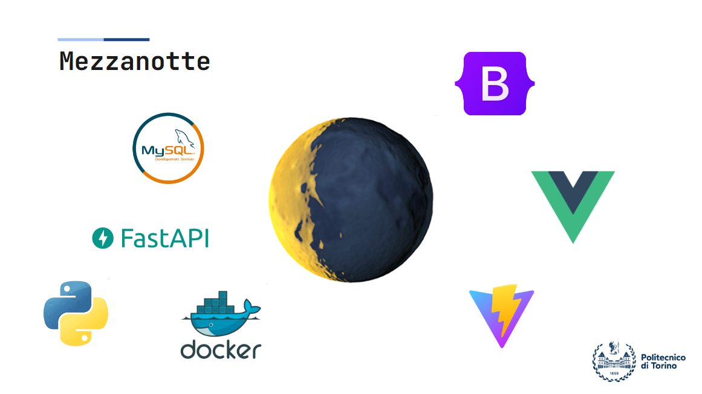
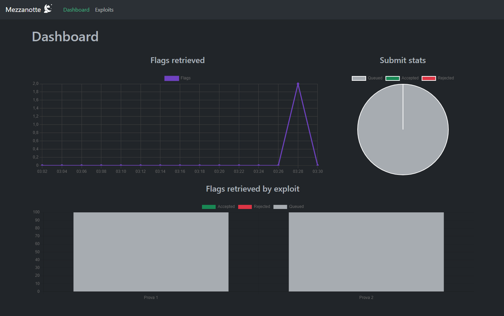
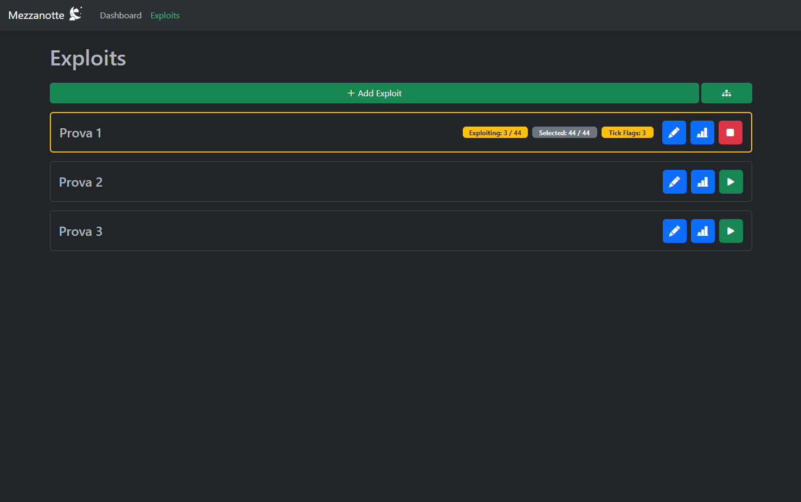
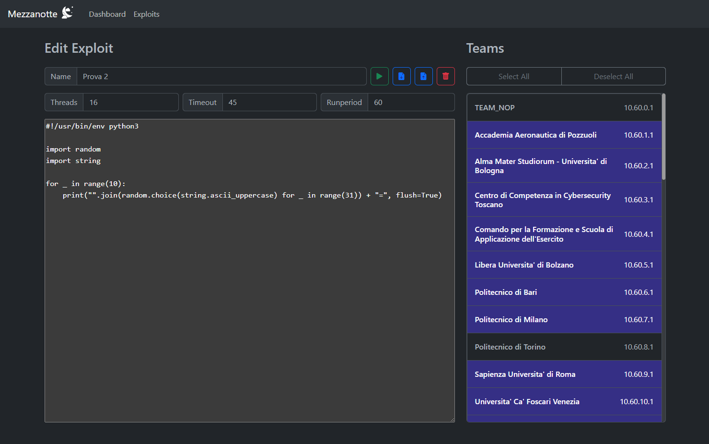

Mezzanotte
================

Applicazione sviluppata per una competizione di attacco e difesa.
Questo tool permette all'utente di eseguire in rapida successione molteplici exploit verso diversi servizi dei team avversari.
Permette inoltre di visualizzare statistiche relative al successo degli attacchi e a quante flag sono state rubate in determinato lasso temporale.

Lo stack è composto da un frontend in VueJs che comunica con una API scritta in python con FastAPI mediante l'invio di dati in formato JSON. Il database si basa su MySQL. Il tutto è stato reso facilimente accessibile da ogni dispositivo attraverso l'utilizzo di Docker.

